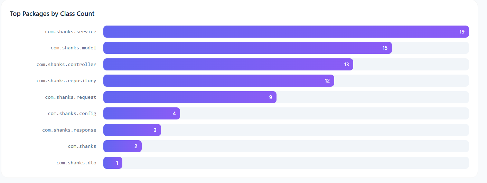
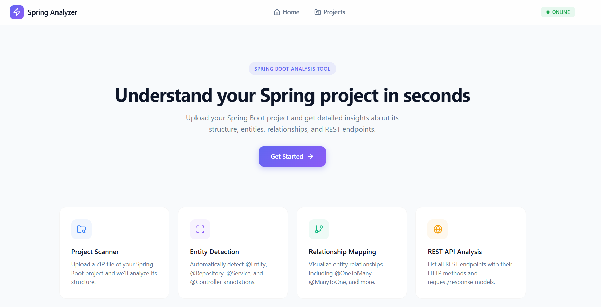
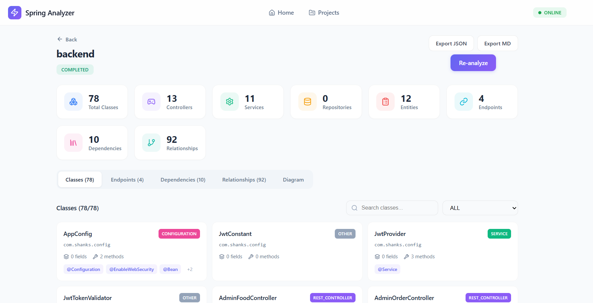
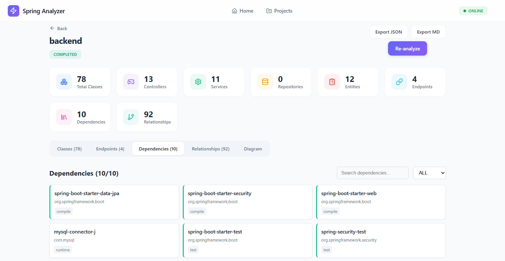
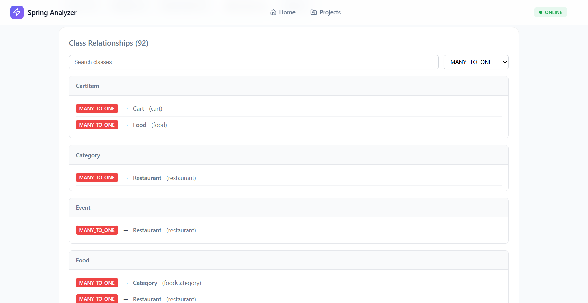
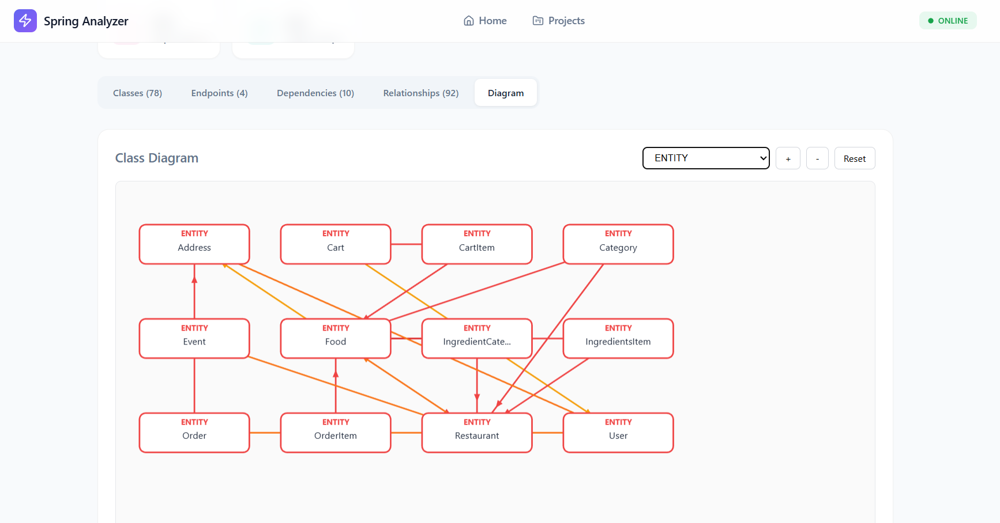
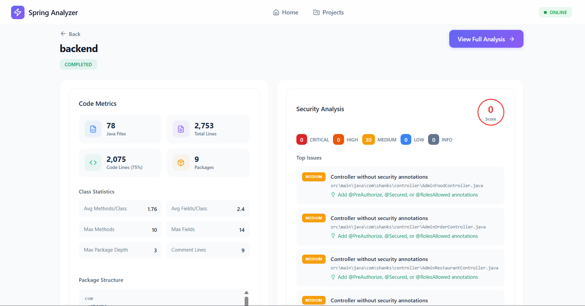
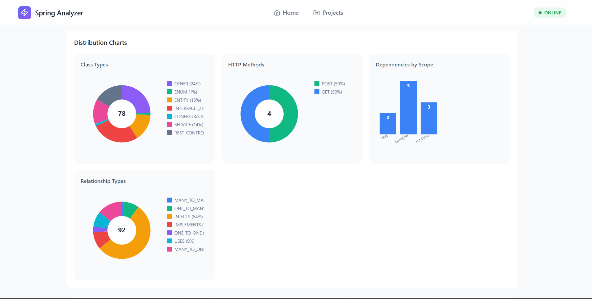

# SpringAnalyzer

SpringAnalyzer is a simple tool designed to help you analyze and manage your Spring-based Java projects. It provides both a backend (Java Spring Boot) and a frontend (React) for a complete, user-friendly experience.

## Screenshots

Here are some screenshots of SpringAnalyzer in action:










## Features
- Analyze Spring project structure and endpoints
- Visual dashboards and charts
- Easy project upload and management

## Getting Started

### Backend
1. Go to the `backend` folder.
2. Run the backend with Maven:
   ```sh
   ./mvnw spring-boot:run
   ```
   Or on Windows:
   ```sh
   mvnw.cmd spring-boot:run
   ```

### Frontend
1. Go to `frontend/spring-analyzer`.
2. Install dependencies:
   ```sh
   npm install
   ```
3. Start the frontend:
   ```sh
   npm start
   ```

## Project Structure
- `backend/` - Java Spring Boot API
- `frontend/spring-analyzer/` - React web app

## Contributing
Pull requests are welcome! For major changes, please open an issue first.


## Architecture

SpringAnalyzer is designed with a clear separation between the backend and frontend, following a two-tier (client-server) architecture. Here’s a more detailed look at each part:

### Backend (API Server)
- **Technology:** Java Spring Boot
- **Responsibilities:**
   - Handles all business logic and data processing
   - Analyzes uploaded Java Spring projects to extract endpoints, structure, and metadata
   - Manages project storage and retrieval
   - Provides RESTful API endpoints for the frontend to interact with
   - Handles security, validation, and error management
- **How it works:**
   - When a user uploads a project or requests analysis, the backend processes the files, scans the codebase, and generates structured data (such as lists of endpoints, controllers, and services).
   - The backend stores analysis results and serves them to the frontend on request.

### Frontend (Web Client)
- **Technology:** React with TypeScript
- **Responsibilities:**
   - Offers a modern, interactive user interface for uploading projects, viewing analysis results, and navigating dashboards
   - Visualizes data from the backend using charts, tables, and dashboards
   - Handles user authentication and session management (if enabled)
   - Sends HTTP requests to the backend API and displays responses
- **How it works:**
   - The frontend is a single-page application (SPA) that runs in the browser.
   - It communicates with the backend using HTTP (typically via fetch or axios), sending user actions (like uploads or analysis requests) and rendering the results.

### Communication
- The frontend and backend communicate over HTTP using a REST API.
- All data (such as project files, analysis results, and user actions) is exchanged in JSON format.
- The backend can be hosted separately from the frontend, allowing for flexible deployment (e.g., backend on a server, frontend on static hosting).

### Example Workflow
1. User uploads a Spring project through the frontend.
2. The frontend sends the project files to the backend via an API call.
3. The backend analyzes the project and stores the results.
4. The frontend fetches the analysis results and displays them as charts, tables, or lists.

This architecture makes SpringAnalyzer easy to maintain, scale, and extend. You can update the backend or frontend independently, and even integrate with other tools or services as needed.


## Authors
This project was created by [Hassan Abidar].

## License
This project is open source. Feel free to use and modify it.


